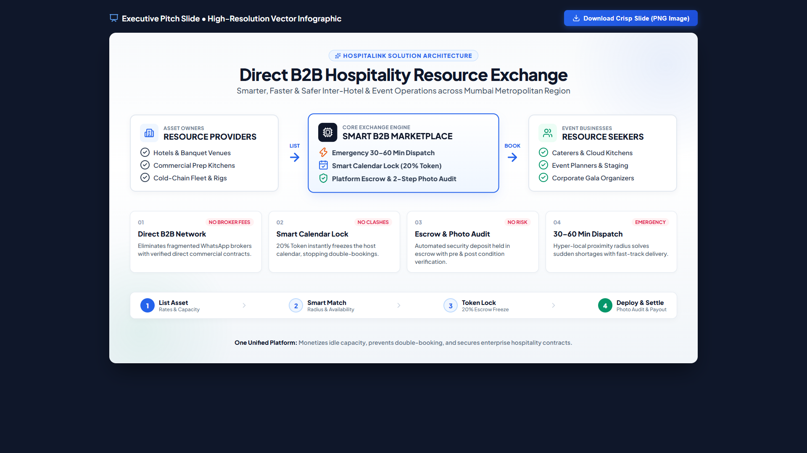

# HospitaLink B2B — Enterprise Hospitality Resource Exchange (MMR Edition)

[](https://github.com/anassk-cell/pillai-hackathon)
[-emerald)](#)
[](#)

A high-performance, enterprise-grade B2B platform prototype tailored exclusively for the **Mumbai Metropolitan Region (MMR)**. It enables commercial hospitality enterprises (hotels, catering networks, banquet venues, and event production fleets) to share, borrow, and monetize high-capacity assets with zero middleman broker fees.

---

## 🏛️ Proposed Solution Architecture



> **Interactive Presentation Slide**: You can view and download a 4K PNG of this chart via [`proposed_solution.html`](proposed_solution.html).

---

## 🌟 Key Features & Innovations

### 1. Dual-Booking Modes
- **⚡ Emergency / Instant Dispatch Mode**: Fast-track booking toggle for sudden shortages (30–60 min dispatch) based on hyper-local proximity (5–15 km radius filter using mathematical **Haversine formula** from the BKC Central Logistics Depot).
- **📅 Planned Advance Pre-Booking**: Full date picker with automatic **20% Token Amount calculation** for initial date-locking and calendar freezing.

### 2. Smart Calendar Lock & Provider Negotiation
- **3-Way Incoming Request Handling**: Providers can **Accept & Freeze**, **Reject**, or submit **Real-Time Counter-Offers** (Negotiate custom contract rates and delivery hours).
- **Double-Booking Prevention**: Once a token is paid or a booking is approved, the asset's calendar is frozen across the marketplace.

### 3. Escrow & 2-Step Digital Condition Audit
- **Platform Escrow Deposit**: Automatic breakdown of platform-held 50% refundable security deposit during checkout.
- **2-Step Photo Checklist (`#audit-modal`)**:
  1. *Pre-Dispatch Verification*: Cleanliness, operational test, and hygiene seal with GPS timestamped photo proof.
  2. *Post-Return & Escrow Release*: Defect inspection sign-off that releases escrow funds back to the seeker.

### 4. 3PL Logistics & Two-Way Discount Engine
- Flexible selection between **In-Store Pickup (Free)** and **Site Delivery (Porter/Borzo Simulator)**.
- **Fare Formula**: Base ₹350 + (Distance in km × ₹25/km).
- **Automatic 20% Round-Trip Discount**: Applying return-leg logistics deducts 20% from the total delivery fare.

### 5. Automated Fleet Monetization & ROI Calculator
- Interactive tool in the **Provider Dashboard** with 3 live reactive range sliders:
  - *Idle Assets in Fleet* (1–10 units)
  - *Rented Days / Month* (1–30 days)
  - *Daily Rate* (₹1,000–₹50,000)
- Shows live **Projected Monthly Net** (net of 10% platform fee), **Annualized Revenue (₹ Lakhs)**, **Utilization %**, and **Estimated ROI Payback (Months)**.
- One-click button pre-fills the asset listing modal at the calculated rate.

---

## 📍 MMR Operational Hub Coverage
Strictly localized to 6 major hubs across the Mumbai Metropolitan Region:
- **Mumbai**: Lower Parel, Dadar West, Ghatkopar West, Andheri East
- **Thane**: Majiwada, Dombivli East, Kalyan West
- **Navi Mumbai**: Vashi, Panvel
- **Bhiwandi**: Bhiwandi Industrial Hub, Anjur Phata
- **Kalyan**: Kalyan West
- **Vasai**: Vasai East Extended MMR

---

## 🚀 How to Run Locally

### Option 1: Direct File Launch
Double-click `index.html` in your browser. Zero npm dependencies or build tools required.

### Option 2: Local Web Server
```bash
# Python
python -m http.server 8080

# Or Node
npx serve .
```
Navigate to `http://localhost:8080` in Chrome, Edge, or Firefox.

---

## 📁 Project Structure
```
pillai-hackathon/
├── index.html                   # Core semantic web app (Marketplace + Provider Dashboard + Modals)
├── styles.css                   # Enterprise CSS design system, themes, and animations
├── js/
│   ├── data.js                  # Central MMR inventory dataset, coordinates, and mock requests
│   └── app.js                   # Application state engine, proximity math, dual booking, modals
├── proposed_solution.html       # Standalone 16:9 solution presentation slide with 1-click PNG export
├── solution_slide_preview.png   # High-resolution vector architecture preview
└── README.md                    # Project documentation
```

---

© 2026 HospitaLink B2B Systems. Developed for Pillai Hackathon.
